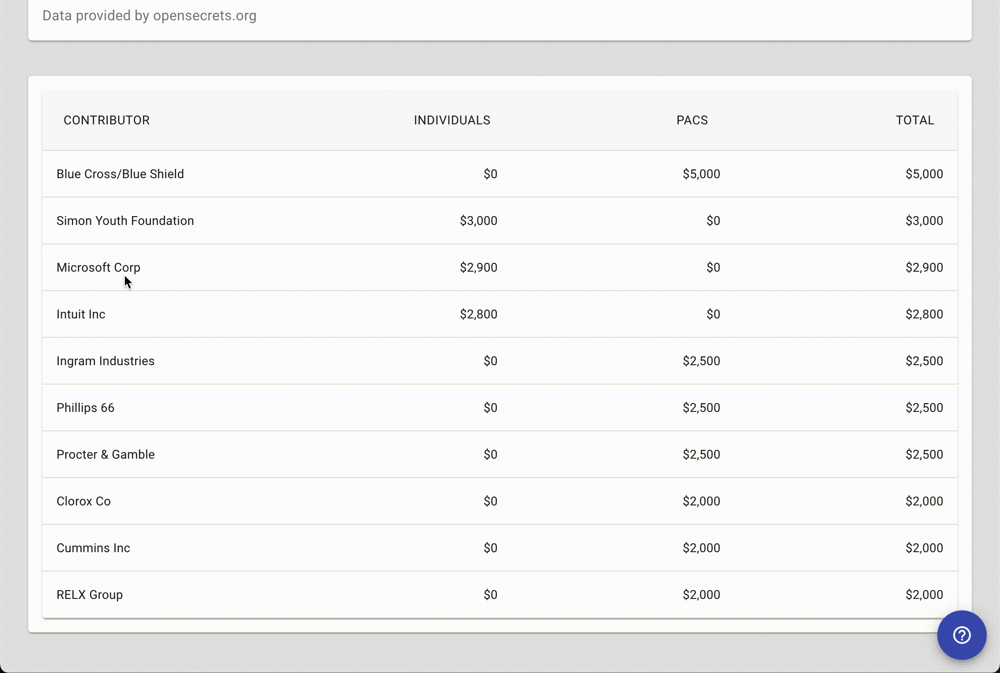

<!-- ##Problem Statement

When looking at campaign finance information, the convoluted nature of transaction records is generally difficult for people to interpret. With millions of records per election cycle and complicated layers of organizational data, voters cannot reasonably draw conclusions on their own.

We make it easy by summarizing information about every current member of congress.
Someone: Take Sam. Sam is a voter in Texas who has to make a decision about which representative to vote for in the upcoming federal election cycle. Sam would like to learn about the incumbent candidate in her district and wants to see a historical record of donors to her representative. Sam can use her state and district or the representative’s name directly to find and display an informative summary about donations to the representative. Sam knows that she lives in district 26 but doesn’t know who her representative is, she searches for TX and district 26 and finds that her representative is Michael Burgess.

##Application

When Sam selects the representative, she will see basic information about the representative, an interactive and branchable network graph, and a table summary of the top 10 donor organizations to the senator in their last election cycle.

Sam can explore candidate - organization connections further by using the branch tool. When she clicks on an organization’s node, the top 10 legislators that the selected organization donated to over the past 10 years will populate and grow the network. She can continue to explore these relationships deeper by clicking on another legislator and seeing their top 10 donor organizations and so on.

Sam can also explore information about the originally selected legislator in the organizational data table at the bottom of the page. Sam can see general total donation amounts for the top 10 donors to the initially selected politician. She can see summaries about each organization and their donation habits and totals. If she doesn’t know what a column’s data means, she can click on any of the column heads to view more information.

Now that Sam has explored her representative’s previous campaign finance record, she now feels more equipt to make an assessment about her rep’s values and supporters. Sam can now make a more informed decision when she votes!

##Technologies Used:

Our webapp was built using React, Redux, Node.js, Express, and Material.UI
To render the network graph, we used Vis.js and Vis-React
For our data, we used our own multi-million row PostgreSQL database in combination with API calls to OpenSecrets.org -->

# Webfluence

## _An Interactive Network Graph to Explore Political Donor Connections_

<a href="https://webfluence.herokuapp.com" target="_blank">Visit Webfluence</a> 
 
<a href="https://drive.google.com/file/d/1FXTZNYUlonZUYC0ZRj6Uil8v8gCOTZYn/view?usp=sharing
" target="_blank">Watch the Demo Video</a>

---

## About Webfluence

Webfluence is an app where you can see the connections between federal legislators and their largest donors. Drawing connections between many politicians and their donors is generally difficult for the average person, unless you're an investigative journalist — and even then it takes hours of pouring over public records! We make it easy by drawing the connections for you using the most recent election cycle data!

- Select a politican from the selection box
- Select the branch tool from the network graph tool set
- Click on any exterior node to branch the graph further

> ### _Who are the major donors tied to your lawmakers?_

 

Explore information about the selected candidates top 10 donors in the summaries table beneath the network graph.

---

## Tech Stack

- 
- 
- 
- 
- 
- 
- 
- 

Built with <a href="https://github.com/FullstackAcademy/boilermaker" target="_blank" >Fullstack Academy Boilermaker</a>

 

---

## The Engineers

Webfluence was created by Sakib Hossain, Doug Henderson, Kyle Combs, and Jonathan Blanco as part of their senior capstone for Fullstack Academy, completed in just 2 weeks!

- <a href="https://github.com/Sakib1211" target="_blank">
Sakib Hossain

- <a href="https://github.com/dhend595" target="_blank">
Doug Henderson

- <a href="https://github.com/kylecombs" target="_blank">
Kyle Combs

- <a href="https://github.com/jonblanco-gif" target="_blank">
Jonathan Blanco

